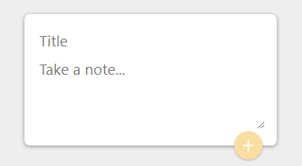
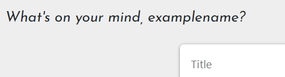
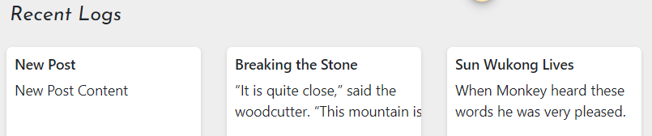
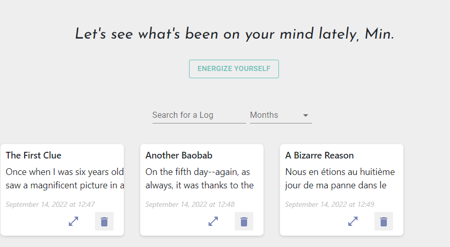
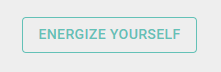
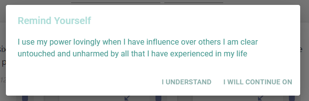
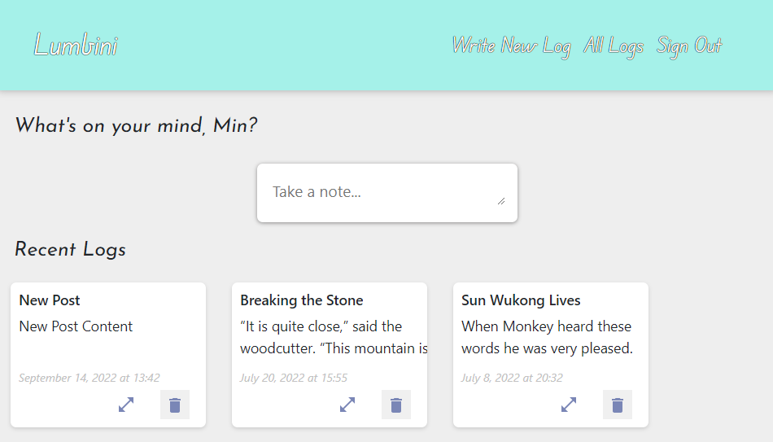

# Lumbini - Your New Diary, Secure and Responsive

Lumbini is an app that acts as a personal diary for our users. Had a good day and want to preserve the memory? Had a bad day and want to vent? Want to write down some thoughts so you can look back on them? Then Lumbini is your friend!

[Stack: React.js Frontend, Express.js Backend, SQLite3 Database]

## Personalized Diary

You can create your own diary via an account with us! Only you can access your diary as we store our passwords securely with a hashing algorithm (bcrypt) and stored separately on our database servers. There's no trace left behind so nobody can invade your privacy!

Other users cannot access your diary either.

You can create new diary logs by inputting your diary title and diary content within this element:

    

You also get a personalized greeting to make you feel right at home!

    

On the "new-log" page, you can see your five most recent logs:

    

When you create a new log it automatically gets logged to both the "all-logs" page and down below in the "new-log" page within its "Recent Logs" section as shown in the image above.
## See All Past Posts

As your entries are saved in our <em>secure</em> database, they will persist upon refreshes and repeated log-ins to your account. Similarly deleted notes will remain deleted and you will be prompted to confirm your deletion upon every attempted delete.

You can even use our responsive search bar and months filter to find specific posts by searching for the title! (Year filter coming soon!)

    

You hit the "Energize Yourself" button to show a pop up that contains a uniquely new affirmation each time it is clicked.

    

    

Continue to feel good about your day, yourself, and your diary!
## To Summarize

Sign up today to join the Lumbini Community and make your own diary.

A safe and secure place to store your thoughts!

Welcome all

    

